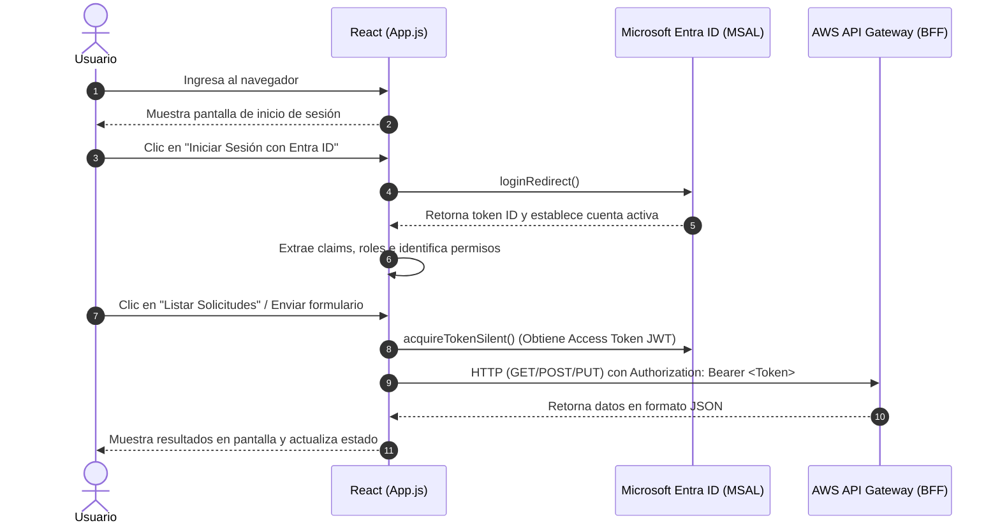

# MesaTech Cloud - Análisis de Arquitectura y Componentes Frontend

Este documento detalla el funcionamiento completo del frontend de **MesaTech Cloud**, explicando el rol de cada archivo, las tecnologías integradas, el ciclo de vida de los estados y la interacción con los servicios en la nube.

---

## 1. Resumen General del Sistema

**MesaTech Frontend** es una aplicación SPA (*Single Page Application*) construida en **React 19** para la gestión de solicitudes y tickets de soporte técnico de TI.

### Arquitectura de Integración
- **Autenticación e Identidad Corporativa**: Basada en **Microsoft Entra ID** (anteriormente Azure Active Directory) mediante el estándar OAuth 2.0 / OpenID Connect, utilizando la librería MSAL (`@azure/msal-react` y `@azure/msal-browser`).
- **Backend en la Nube (AWS)**: Conexión mediante HTTP REST contra **AWS API Gateway** (`https://iwnne47f0f.execute-api.us-east-1.amazonaws.com`), el cual expone una capa BFF (*Backend For Frontend*) encargada de rutear y securizar el acceso a los microservicios subyacentes.

---

## 2. Mapa de Archivos y Componentes

| Archivo | Rol Principal |
| :--- | :--- |
| [`package.json`](file:///home/manuel/Documentos/mesatech-frontend/package.json) | Configuración de dependencias (MSAL, Axios, React 19) y scripts de ejecución. |
| [`src/index.js`](file:///home/manuel/Documentos/mesatech-frontend/src/index.js) | Inicialización de MSAL y punto de montaje de React en el DOM. |
| [`src/authConfig.js`](file:///home/manuel/Documentos/mesatech-frontend/src/authConfig.js) | Credenciales y parámetros de conexión con el Tenant de Microsoft Entra ID. |
| [`src/App.js`](file:///home/manuel/Documentos/mesatech-frontend/src/App.js) | Componente central: gestión de sesión, roles, máquina de estados, llamadas a API y UI. |
| [`src/App.css`](file:///home/manuel/Documentos/mesatech-frontend/src/App.css) / [`src/index.css`](file:///home/manuel/Documentos/mesatech-frontend/src/index.css) | Hojas de estilo generales de la aplicación. |

---

## 3. Desglose Técnico por Archivo

### A. [`src/authConfig.js`](file:///home/manuel/Documentos/mesatech-frontend/src/authConfig.js)
Define las constantes de configuración requeridas por la biblioteca MSAL:

- **`msalConfig`**:
  - `auth.clientId`: Identificador de la aplicación cliente registrada en Microsoft Entra ID (`563f3b76-e7c5-417d-94b2-68ec5bfdc9c0`).
  - `auth.authority`: Endpoint del tenant que emite los tokens (`https://login.microsoftonline.com/6c5abb9a-09e5-470d-9973-e54cf9ad6475`).
  - `auth.redirectUri`: URL local (`http://localhost:3000`) a la que Entra ID redirige tras la autenticación.
  - `cache.cacheLocation`: Configurado en `"sessionStorage"` para retener la sesión durante la vida de la pestaña sin persistirla indefinidamente.
  - `system.loggerOptions`: Filtro de logs para depuración en consola, omitiendo información confidencial o PII.
- **`loginRequest`**:
  - `scopes`: Define el scope requerido (`api://5d67c44c-524d-4958-921f-fe75b912a037/.default`). Esto garantiza que el JWT emitido contenga la audiencia requerida por el backend en AWS API Gateway.

---

### B. [`src/index.js`](file:///home/manuel/Documentos/mesatech-frontend/src/index.js)
Es el punto de arranque de la aplicación web:

1. Crea la instancia cliente de autenticación:
   ```javascript
   const msalInstance = new PublicClientApplication(msalConfig);
   ```
2. Envuelve la jerarquía de componentes con `<MsalProvider instance={msalInstance}>`.
3. Esto distribuye el contexto de autenticación a toda la app mediante React Context, habilitando el uso de hooks como `useMsal` y `useIsAuthenticated`.

---

### C. [`src/App.js`](file:///home/manuel/Documentos/mesatech-frontend/src/App.js)
Contiene la lógica de negocio y las vistas del sistema.

#### 1. Autenticación y Cuentas
- `useMsal()`: Proporciona la instancia del cliente (`instance`) y la lista de cuentas activas (`accounts`).
- `useIsAuthenticated()`: Indica si el usuario completó la autenticación.
- `correoUsuario`: Determina el identificador o email del usuario activo inspeccionando `username` o el claim `preferred_username`.
- `handleLogin()`: Ejecuta `instance.loginRedirect(loginRequest)` para llevar al usuario a la pantalla corporativa de Microsoft.
- `handleLogout()`: Limpia la sesión y redirige a la URL configurada.

#### 2. Control de Roles (RBAC - Role-Based Access Control)
- Los roles se extraen de los claims del token decodificado o del ID Token:
  ```javascript
  const rolesUsuario = tokenDecodificado?.roles || activeAccount?.idTokenClaims?.roles || [];
  ```
- **Lógica de permisos**:
  - `esCliente`: Identifica si posee el rol `ROLE_CLIENTE`.
  - `esOperadorOAdmin`: Identifica si posee `ROLE_OPERADOR` o `ROLE_ADMIN`.
  - `puedeActualizar`: Habilita la sección de edición y actualización de estados solo si el usuario es operador o administrador.

#### 3. Máquina de Estados para Solicitudes (`obtenerSiguientesEstados`)
Regula la transición válida de estados de los tickets:

| Estado Actual | Siguientes Estados Permitidos | Es Estado Final |
| :--- | :--- | :--- |
| `CREADA` | `ASIGNADA`, `CANCELADA` | No |
| `ASIGNADA` | `EN_PROCESO` | No |
| `EN_PROCESO` | `RESUELTA` | No |
| `RESUELTA` | `CERRADA` | No |
| `CERRADA` | Ninguno (`[]`) | Sí |
| `CANCELADA` | Ninguno (`[]`) | Sí |

- La variable `estaDeshabilitadoActualizar` deshabilita el selector y el botón si el ticket ya se encuentra cerrado, cancelado o sin transiciones posibles.
- Un `useEffect` mantiene sincronizado el selector `nuevoEstado` con la primera opción permitida ante cualquier cambio de ticket.

#### 4. Obtención y Decodificación de Tokens (`obtenerToken`)
- Invoca `instance.acquireTokenSilent()` para obtener de forma transparente un Access Token válido.
- Decodifica el payload del JWT mediante `atob(payloadBase64)` y `JSON.parse` para almacenar en `tokenDecodificado` claims de auditoría (`iss`, `aud`, `roles`).

#### 5. Comunicación con el Backend (AWS API Gateway)
- **`llamarApiGet(endpoint)`**:
  - Realiza peticiones `GET` inyectando el token Bearer en el encabezado `Authorization`.
  - Utilizado para consultar `/api/bff/solicitudes`, `/api/bff/categorias` y `/api/bff/prioridades`.
  - **Filtro de seguridad en el cliente**: Si el usuario autenticado es exclusivamente un cliente (`esCliente && !esOperadorOAdmin`), filtra las solicitudes para presentarle únicamente aquellas creadas por su correo (`s.usuarioSolicitante === correoUsuario`).
- **`crearSolicitud(e)`**:
  - Envía mediante `POST` el payload con `titulo`, `descripcion`, `categoriaId`, `prioridadId` y `usuarioSolicitante`.
- **`actualizarSolicitud(e)`**:
  - Envía mediante `PUT` a `/api/bff/solicitudes/{id}` el `nuevoEstado`.
  - Modifica el estado reactivo local (`respuestaApi`) para reflejar la actualización inmediatamente sin requerir recarga completa.

#### 6. Secciones de la Interfaz de Usuario
1. **Pantalla de Bienvenida**: Visible cuando el usuario no está autenticado, con el botón de inicio de sesión con Microsoft Entra ID.
2. **Barra de Sesión**: Nombre del usuario, correo, roles activos y botón de desconexión.
3. **Banner de Notificaciones / Errores**: Visualización de mensajes de error de red o permisos.
4. **Consultas Rápidas**: Botones directos para invocar los endpoints de listado de solicitudes, categorías y prioridades.
5. **Formulario de Creación**: Campos de título, descripción, selección de categoría y prioridad.
6. **Formulario de Actualización**: Visible solo para roles autorizados; permite seleccionar el ID de la solicitud y el estado de destino según el flujo permitido.
7. **Visor de Claims del Token**: Demostración visual de identidad para auditoría (emisor, audiencia, roles asignados).
8. **Visor de Respuesta Backend**: Contenedor de código que formatea el JSON retornado por AWS API Gateway.

---

## 4. Diagrama de Flujo de Datos


